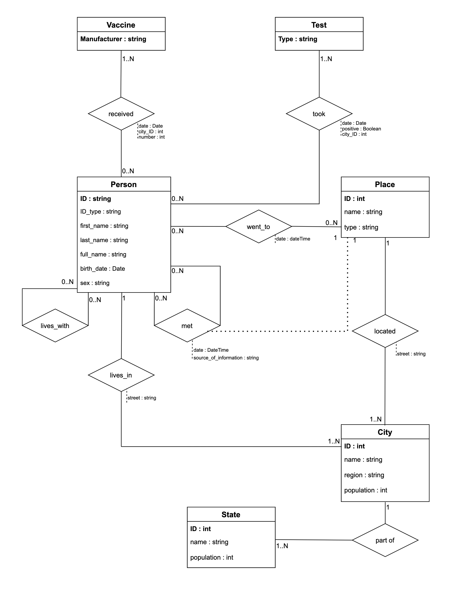
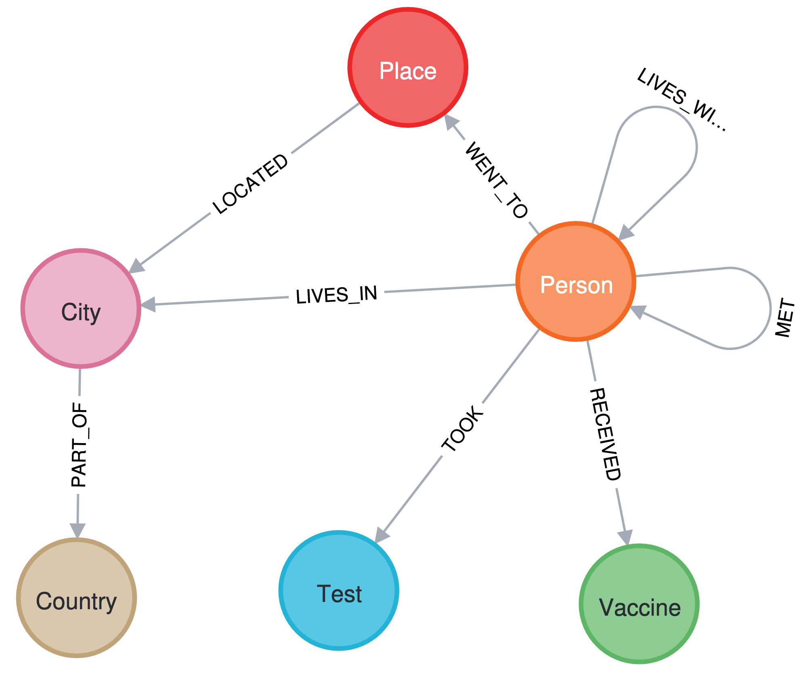
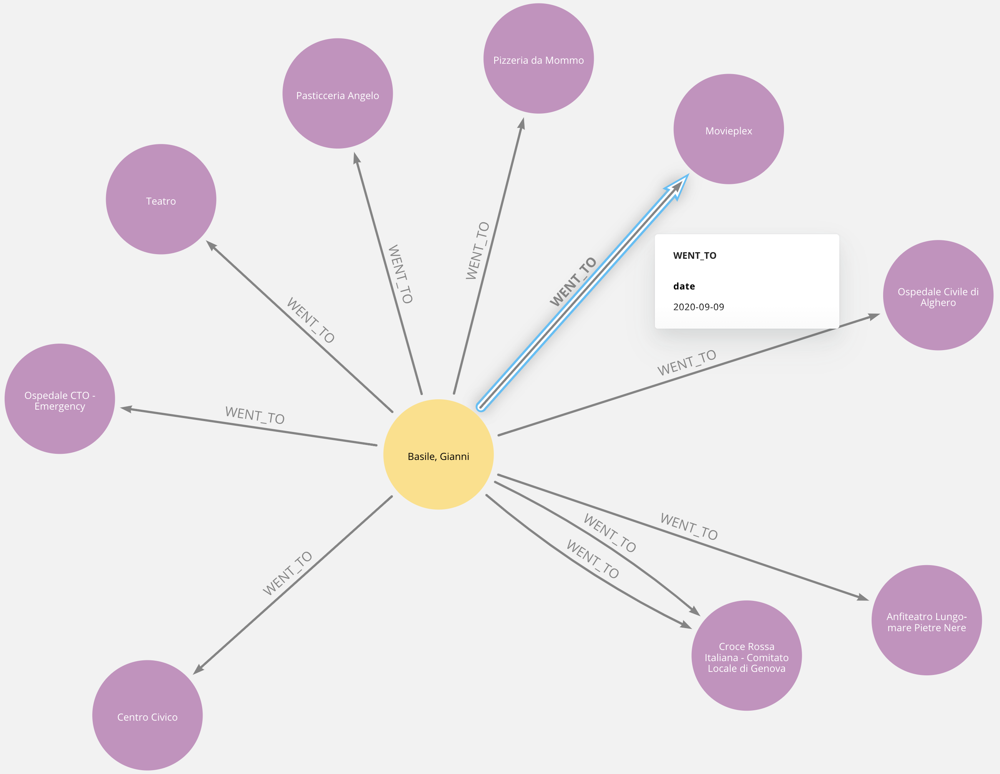
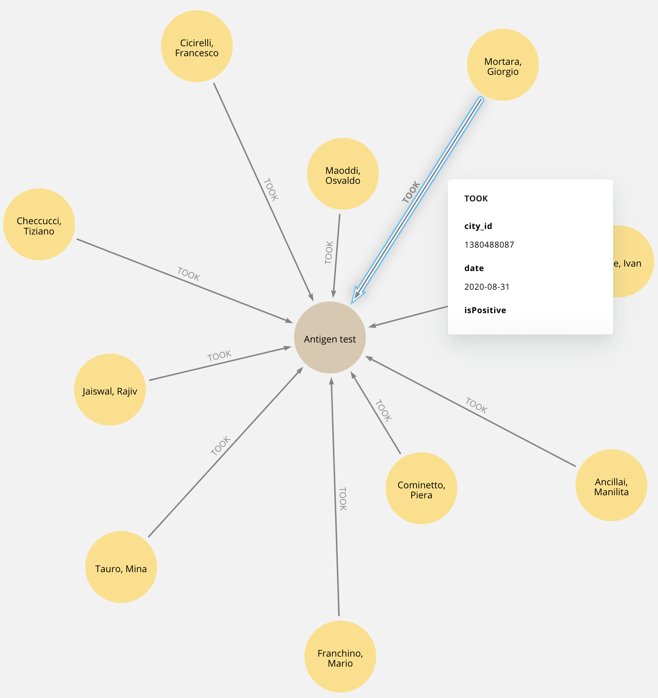
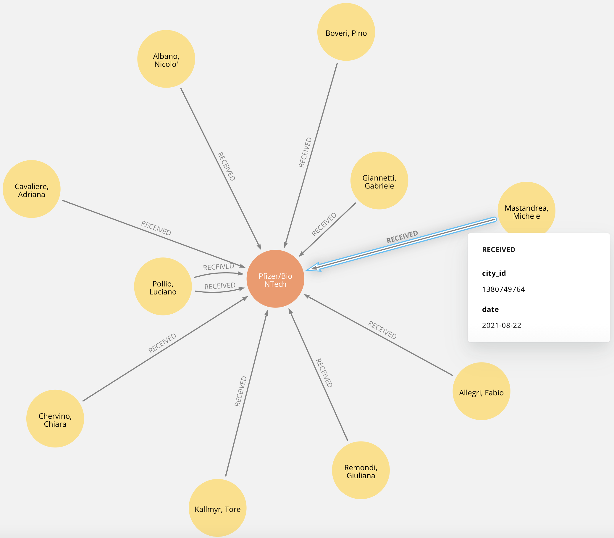
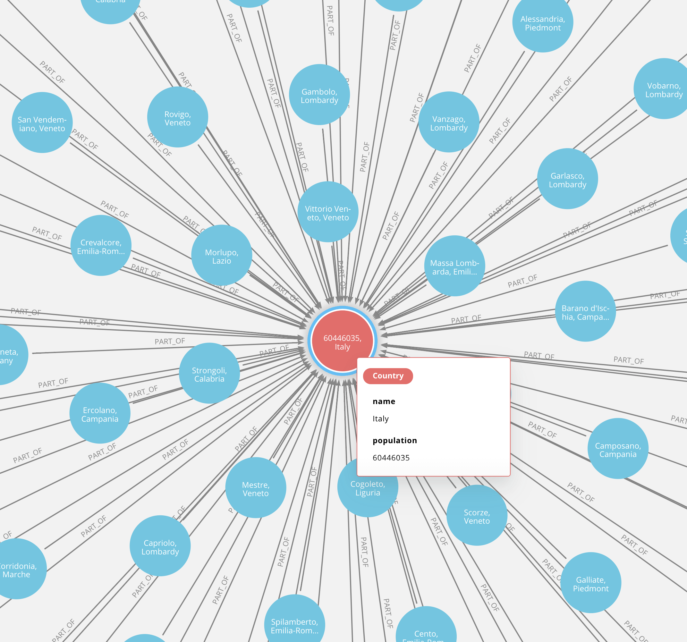
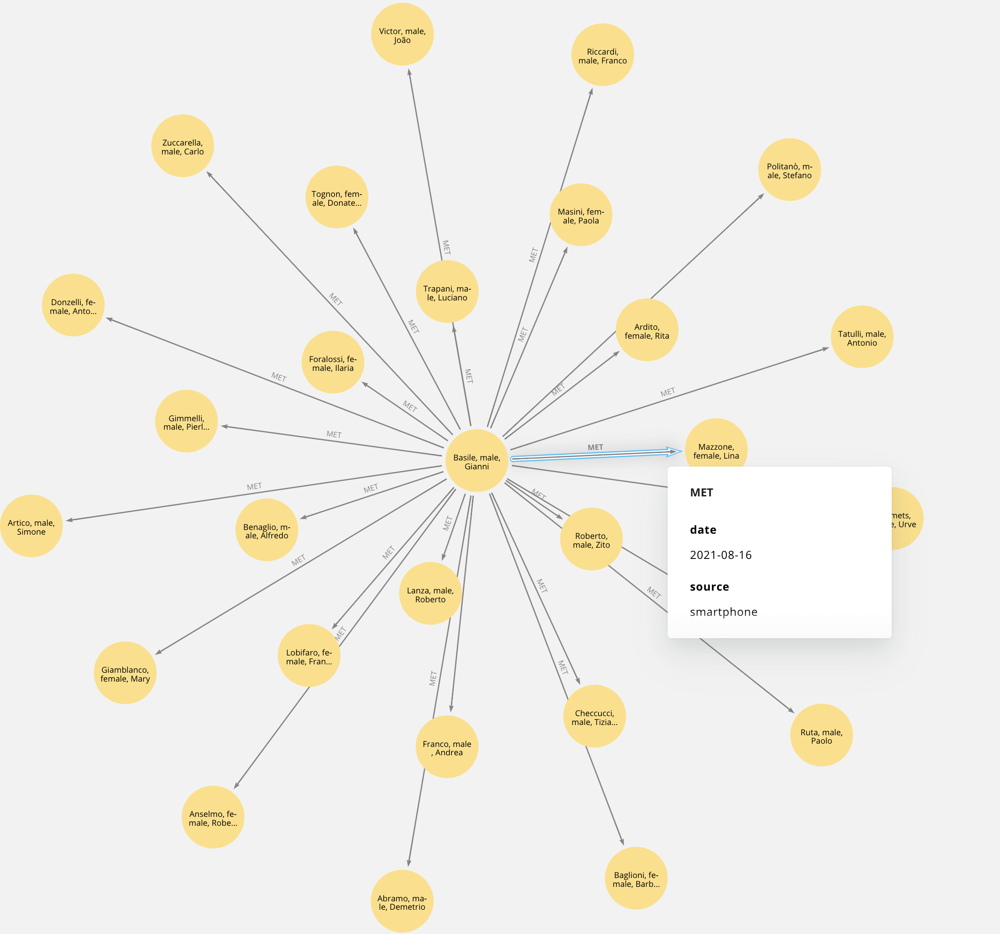
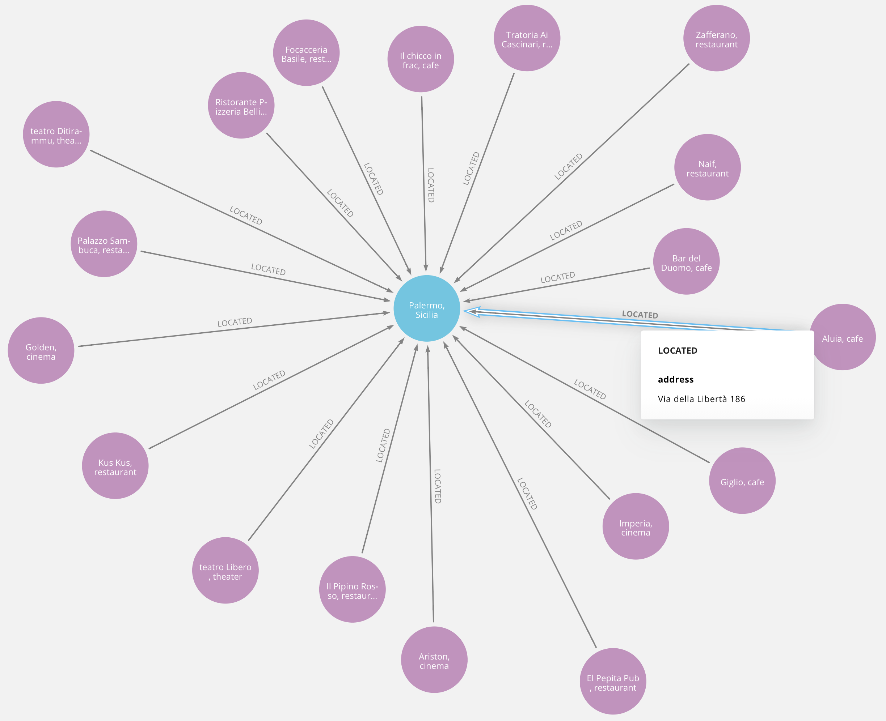
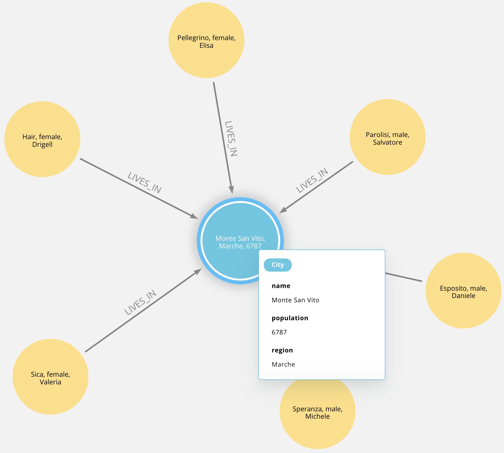

<p align="center">
  <i><font size="3">
  	Systems and Methods for Big and Unstructured Data - Delivery #1 - AA 2021/2022 - Prof. Marco Brambilla
  </i>
</p>
<h1 align="center">
	<strong>
	🦠Neo4j Covid Tracing Database
	</strong>
	<br>
</h1>
<p align="center">
<font size="3">
		<a href="https://neo4j.com/">Neo4j</a>		 
		•		
		<a href="report/report.pdf">Report</a>   
	</font>
</p>

Considering the scenario in which there’s the need to build a system for managing the **COVID-19 pandemic** in a specific country, 
our project focuses on the data perspective level. This is why we designed and implemented a **Neo4j** data structure to face the need of contact tracing functionality,
to monitor the viral diffusion. 

# Contents

- ⚙ [System requirements️](#-system-requirements)
- 🚀 [Setup instructions](#-setup-instructions)
- 📜 [Report](report.pdf)
- 👨‍💻 [Usage](#-usage)
	- [Load DB Dump](#load-db-dump) 
	- [Load from CSV](#load-from-csv)
- 🗄️ [Database dump](https://1drv.ms/u/s!Ahq9yFCnfdZEjulz7J5lFAN65v9tvQ?e=MvCgVh)
- 📊 [Diagrams](#-diagrams)
- 📷 [Relationships Visualizations](#-relationships-visualizations)  
- 💡 [About database population scripts](#-about-database-population-scripts)
- 📝 [License](#-license)

# ⚙ System requirements

## Required software

- [Python](https://www.python.org/) 3.8 or higher **(only if you want to perform manual load from CSVs)**
- [Neo4J](https://neo4j.com) database
- Python modules in [requirements.txt](requirements.txt)  **(only if you want to perform manual load from CSVs)**


# 🚀 Setup instructions

## Clone the repo

    git clone https://github.com/pablogiaccaglia/neo4j-covid-tracing
    cd neo4j-covid-tracing/

## Install required packages

From the project's directory run the following commands:

    pip install -r requirements.txt
    
# 👨‍💻 Usage

## Load from CSV

This operation is advise only if you want to have full control of the database from the data collection and generation point of view, since the process of populating the database takes a lot of time, as stated [here](#-about-database-population-scripts).<br>


The first step is to move the CSV files inside the <a href="import">import</a> folder into the corresponding Neo4j folder, whose location changes as follows:
	
<div class="sectionbody">
<div class="paragraph">
</div>
<table id="table-file-locations" class="tableblock frame-all grid-all stretch">
<colgroup>
<col style="width: 16.6666%;">
<col style="width: 16.6666%;">
<col style="width: 16.6666%;">
<col style="width: 16.667%;">
</colgroup>
<thead>
<tr>
<th class="tableblock halign-left valign-top">Linux / macOS / Docker</th>
<th class="tableblock halign-left valign-top">Windows</th>
<th class="tableblock halign-left valign-top">Debian / RPM</th>
<th class="tableblock halign-left valign-top">Neo4j Desktop <a id="tnoteref1"></th>
</tr>
</thead>
<tbody>
<tr>
</p></td>
<td class="tableblock halign-left valign-top"><p class="tableblock"><em>&lt;neo4j-home&gt;/import</em></p></td>
<td class="tableblock halign-left valign-top"><p class="tableblock"><em>&lt;neo4j-home&gt;\import</em></p></td>
<td class="tableblock halign-left valign-top"><p class="tableblock"><em>/var/lib/neo4j/import</em></p></td>
<td class="tableblock halign-left valign-top"><p class="tableblock">From the <em>Open</em> dropdown menu of your Neo4j instance, select <em>Terminal</em>, and navigate to <em>&lt;installation-version&gt;/import</em>.</p></td>
</tr>
</tbody>
</table>
</div>

<br>

Then info of a connection to the Neo4j database is needed.
As you can see in the <a href="scripts/main.py#L489">main</a>  method of the <a href="scripts/main.py">main.py</a> file, a <code>CovidGraphHandler</code> object is created in the following way:

```python
   handler = CovidGraphHandler("URI", "USER", "PASSWORD")
```

the data passed to the class' constructor is used in the init method to establish a connection through a driver:

```python
   self.driver = GraphDatabase.driver(uri, auth = (user, password), max_connection_lifetime = 1000)
```

Different settings can be specified by changing that line of code. More info available <a href="https://neo4j.com/docs/api/python-driver/current/">here</a> 

After this step all you need to do is execute the main method and wait the routine to complete. 

The Python code manipulates several CSV files which can be found in different versions inside the <a href="datasets">datasets</a> folders. If you want to do further changes to them, make sure to substitute the older version with the new one inside the Neo4j import folder. 
Detailed information of the manipulation process which lead to the final state of the database can be found in the <a href="report/report.pdf">Report</a>.

## Load DB Dump

If you dont' want to use Python or install the requiered dependencies, you can quickly start using the database by loading the dump available <a href="https://onedrive.live.com/?cid=44d67da750c8bd1a&id=44D67DA750C8BD1A%21242931&authkey=!AOyeZRQDeub_bb0">here</a>.
The following section shows how to do so. 
	
<aside class="toc embedded"><div class="toc-menu"><h2>Contents</h2><ul><li data-level="1"><a href="#restore-dump-command">1. Command</a></li><li data-level="2"><a href="#restore-dump-syntax">1.1. Syntax</a></li><li data-level="2"><a href="#restore-dump-command-options">1.2. Options</a></li><li data-level="1"><a href="#restore-dump-example">2. Example</a></li></ul></div></aside><div id="preamble">
<div class="sectionbody">
<div class="quoteblock abstract">
<blockquote>
<div class="paragraph">
<p>This section describes how to restore a database dump in a live Neo4j deployment.</p>
</div>
</blockquote>
</div>
<div class="paragraph">
<p>A database dump can be loaded to a Neo4j instance using the <code>load</code> command of <code>neo4j-admin</code>.</p>
</div>
</div>
</div>
<div class="sect1">
<h2 id="restore-dump-command"><a class="anchor" href="#restore-dump-command"></a>1. Command</h2>
<div class="sectionbody">
<div class="paragraph">
<p>The <code>neo4j-admin load</code> command loads a database from an archive created with the <a href="https://neo4j.com/docs/operations-manual/current/backup-restore/offline-backup/" class="page"><code>neo4j-admin dump</code></a> command.
Alternatively, <code>neo4j-admin load</code> can accept dump from standard input, enabling it to accept input from <code>neo4j-admin dump</code> or another source.</p>
</div>
<div class="paragraph">
<p>The command can be run from an online or an offline Neo4j DBMS.</p>
</div>
<div class="paragraph">
<p>If you are replacing an existing database, you have to shut it down before running the command.
If you are not replacing an existing database, you must create the database (using <code>CREATE DATABASE</code> against the <code>system</code> database) after the load operation finishes.</p>
</div>
<div class="paragraph">
<p><code>neo4j-admin load</code> must be invoked as the <code>neo4j</code> user to ensure the appropriate file permissions.</p>
</div>
<div class="sect2">
<h3 id="restore-dump-syntax"><a class="anchor" href="#restore-dump-syntax"></a>1.1. Syntax</h3>
<div class="listingblock noheader">
<div class="content">
<pre class="highlightjs highlight"><code class="hljs sql">neo4j-admin <span class="hljs-keyword">load</span> <span class="hljs-comment">--from=&lt;archive-path&gt;</span>
                 [<span class="hljs-comment">--verbose]</span>
                 [<span class="hljs-comment">--expand-commands]</span>
                 [<span class="hljs-comment">--database=&lt;database&gt;]</span>
                 [<span class="hljs-comment">--force]</span>
                 [<span class="hljs-comment">--info]</span></code></pre>
</div>
</div>
</div>
<div class="sect2">
<h3 id="restore-dump-command-options"><a class="anchor" href="#restore-dump-command-options"></a>1.2. Options</h3>
<table class="tableblock frame-all grid-all stretch">
<colgroup>
<col style="width: 33.3333%;">
<col style="width: 33.3333%;">
<col style="width: 33.3334%;">
</colgroup>
<thead>
<tr>
<th class="tableblock halign-left valign-top">Option</th>
<th class="tableblock halign-left valign-top">Default</th>
<th class="tableblock halign-left valign-top">Description</th>
</tr>
</thead>
<tbody>
<tr>
<td class="tableblock halign-left valign-top"><p class="tableblock"><code>--from</code></p></td>
<td class="tableblock halign-left valign-top"></td>
<td class="tableblock halign-left valign-top"><div class="content"><div class="paragraph">
<p>Path to archive created with the <code>neo4j-admin dump</code> command, or <code>-</code> to use standard input.</p>
</div></div></td>
</tr>
<tr>
<td class="tableblock halign-left valign-top"><p class="tableblock"><code>--verbose</code></p></td>
<td class="tableblock halign-left valign-top"></td>
<td class="tableblock halign-left valign-top"><div class="content"><div class="paragraph">
<p>Enable verbose output.</p>
</div></div></td>
</tr>
<tr>
<td class="tableblock halign-left valign-top"><p class="tableblock"><code>--expand-commands</code></p></td>
<td class="tableblock halign-left valign-top"></td>
<td class="tableblock halign-left valign-top"><div class="content"><div class="paragraph">
<p>Allow command expansion in config value evaluation.</p>
</div></div></td>
</tr>
<tr>
<td class="tableblock halign-left valign-top"><p class="tableblock"><code>--database</code></p></td>
<td class="tableblock halign-left valign-top"><p class="tableblock"><code>neo4j</code></p></td>
<td class="tableblock halign-left valign-top"><div class="content"><div class="paragraph">
<p>Name for the loaded database.</p>
</div></div></td>
</tr>
<tr>
<td class="tableblock halign-left valign-top"><p class="tableblock"><code>--force</code></p></td>
<td class="tableblock halign-left valign-top"></td>
<td class="tableblock halign-left valign-top"><div class="content"><div class="paragraph">
<p>Replace an existing database.</p>
</div></div></td>
</tr>
<tr>
<td class="tableblock halign-left valign-top"><p class="tableblock"><code>--info</code></p></td>
<td class="tableblock halign-left valign-top"></td>
<td class="tableblock halign-left valign-top"><div class="content"><div class="paragraph">
<p>Print meta-data information about the archive file, such as, file count, byte count, and format of the load file.</p>
</div></div></td>
</tr>
</tbody>
</table>
</div>
</div>
</div>
<div class="sect1">
<h2 id="restore-dump-example"><a class="anchor" href="#restore-dump-example"></a>2. Example</h2>
<div class="sectionbody">
<div class="paragraph">
<p>The following is an example of how to load the dump of the <code>neo4j</code> database created in the section <a href="../offline-backup/#offline-backup-example" class="page">Back up an offline database</a>, using the <code>neo4j-admin load</code> command.
When replacing an existing database, you have to shut it down before running the command.</p>
</div>
	
    bin/neo4j-admin load --from=/dumps/neo4j/neo4j-<timestamp>.dump --database=neo4j --force
	
</td>
	
---


<p>Unless you are replacing an existing database, you must create the database (using <code>CREATE DATABASE</code> against the <code>system</code> database) after the load operation finishes.</p>
	

---
	
<p>When using the <code>load</code> command to seed a Causal Cluster, and a previous version of the database exists, you must delete it (using <code>DROP DATABASE</code>) first.
Alternatively, you can stop the Neo4j instance and unbind it from the cluster using <code>neo4j-admin unbind</code> to remove its cluster state data.
If you fail to DROP or unbind before loading the dump, that database’s store files will be out of sync with its cluster state, potentially leading to logical corruptions.
For more information, see <a href="https://neo4j.com/docs/operations-manual/current/clustering/seed/#causal-clustering-seed-from-backups" class="page">Seed a cluster from a database backup (online)</a>.</p>
	
---


## Load from CSV

# 📊 Diagrams

<h2><p align="center"><b>ER Diagram</b></></h2>

 <p align= "center">
 <kbd> 
 
 </kbd>
 </>
---
	 
<h2><p align="center"><b>ER Diagram</b></></h2>

 <p align= "center">
 <kbd> 
 
 </kbd>
 </>
---
	 
# 📷 Relationships Visualizations

WENT TO        |  TOOK
:-------------------------:|:-------------------------:
|  

---

RECEIVED      |  PART OF
:-------------------------:|:-------------------------:
|  

---

MET           |  LOCATED
:-------------------------:|:-------------------------:
|  

---

LIVES WITH            |  LIVES IN
:-------------------------:|:-------------------------:
|  
	 
# 💡 About database population scripts

	 
The creation script, which can be executed invoking the <a href="https://github.com/pablogiaccaglia/neo4j-covid-tracing/blob/1589bc335e250322837fed4cd52f6d46b6f016eb/scripts/main.py#L33">populateDatabase</a> method of class CovidGraphHandler located inside file <a href="https://github.com/pablogiaccaglia/neo4j-covid-tracing/blob/1589bc335e250322837fed4cd52f6d46b6f016eb/scripts/main.py">main.py</a>, takes approximately 
**6 hours to complete**. <br>
What it creates inside the Neo4j database are:
- **12014** nodes : 
   * 5000 **Person** nodes
   * 4883 **Place** nodes
   * 2123 **City** nodes
   * 4 **Vaccine** nodes
   * 3 **Test** nodes
   * 1 **Country** node
    
- **296682** directed (**593364** undirected) relationships: 
  * 2123 directed (4246 undirected) **PART OF** relationships
  * 1139 directed (2278 undirected) **LOCATED** relationships
  * 3752 directed (7504 undirected) **RECEIVED** relationships
  * 6537 directed (13074 undirected) **TOOK** relationships
  * 8441 directed (16882 undirected) **LIVES WITH** relationships
  * 5000 directed (10000 undirected) **LIVES IN** relationships
  * 119651 directed (239302 undirected) **MET** relationships
  * 150040 directed (300080 undirected) **WENT TO** relationships
 
Information on how the data has been produced can be found on the <a href="report/report.pdf">report</a>   
	 
# 📝 License

This file is part of "Noe4j Covid Tracing Database".

"Neo4j Covid Tracing Database" is free software: you can redistribute it and/or modify
it under the terms of the GNU General Public License as published by
the Free Software Foundation, either version 3 of the License, or
(at your option) any later version.

"Neo4j Covid Tracing Database" is distributed in the hope that it will be useful,
but WITHOUT ANY WARRANTY; without even the implied warranty of
MERCHANTABILITY or FITNESS FOR A PARTICULAR PURPOSE.  See the
GNU General Public License for more details.

You should have received a copy of the GNU General Public License along
with this program (LICENSE.txt).  If not, see <http://www.gnu.org/licenses/>
